## ProcessExecutor步骤类型说明

目前类型分为：  
* 执行、状态控制、进度控制、自定义事件  
* 实例化、销毁、换父节点  
* 活跃状态、启用状态  
* 变换、朝向、相对摄像机  
* 音频单次播放、音频播放控制、音频播放多个  
* 动画参数控制、动画换状态机、动画换形象、动画根移动  
* 时间轴播放控制、时间轴跳转进度  
* 缓动从头开始、缓动播放控制、缓动跳转进度、缓动杀死或重生  
* Unity事件

以下会根据类型，详细讲解界面功能。  

### 执行

该步骤类型用于执行另外的执行器。  
* 当执行器数量小于等于1时，就是单纯的执行另一个执行器。  
  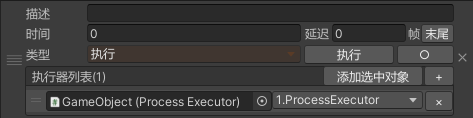  
* 当执行器数量大于1时，会出现其他参数。  
  * 执行个数：每次执行该步骤时，会执行几个执行器。  
  * 其他参数：可选择依次执行和随机执行，该步骤每次执行完后，会记录上一次执行情况，以判断下一次如何执行。  
    * 依次执行：从上往下挨个执行，当执行到列表末尾时，会从头继续执行，该执行方式下会有洗牌选项。  
      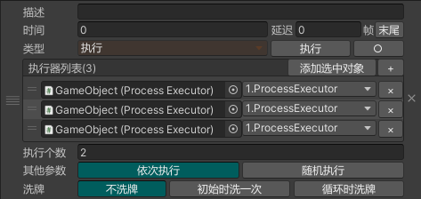  
      * 不洗牌：正常的列表循环。  
      * 初始时洗一次：初始化时打乱列表顺序，之后无论循环几次，顺序都不再变化。  
      * 循环时洗牌：每次执行列表第一个前都会洗牌。  
    * 随机执行：从列表中随机选中指定个数执行，执行个数始终小于列表长度，该执行方式下会有随机选项。  
      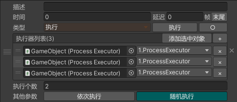  
      * 无限制：正常随机  
      * 不重复：上一次执行过的执行器，不会加入到随机范围内。如果上一次执行个数与将执行个数之和大于列表长度，则该选项无效。  
        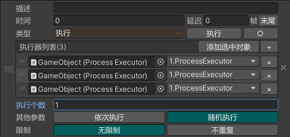  

### 状态控制

该步骤类型用于改变状态控制器的状态。  

* 当未选中「相对偏移」复选按钮时，状态以下拉框的方式选择。  
  * 不随机：直接将控制器改变成目标状态。  
    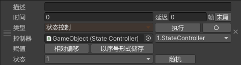  
  * 随机：状态下拉框将变成多选，选中的状态即是随机范围。若选中「不重复」复选按钮，则当前随机结果必然与上一次不同。  
    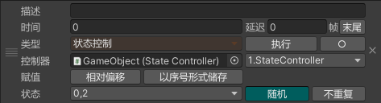  
* 当选中「相对偏移」复选按钮时，可以指定偏移量，每次执行后状态序号将偏移指定值。  
  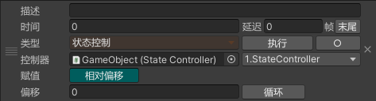  
  * 不循环：当状态偏移到最小或最大序号时，不再变化。  
  * 循环：序号将在最小序号和最大序号之间循环偏移。  

### 进度控制

该步骤类型用于改变进度控制器的进度。  

* 当未选中「相对偏移」复选按钮时，进度以滑块的方式调节。  
  * 不随机：直接将控制器改变成目标进度。  
    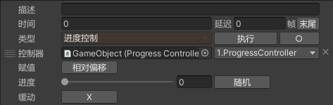  
  * 随机：滑块将变成范围滑块，选中的范围即是随机范围。  
    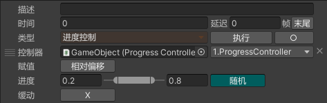  
* 当选中「相对偏移」复选按钮时，可以指定偏移量，每次执行后进度将偏移指定值。  
  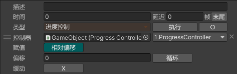  
  * 不循环：当状态偏移到0或1时，不再变化。  
  * 循环：进度将在0-1之间循环偏移。  

### 自定义事件

该步骤类型用于事件通讯，每次执行都将触发指定事件名的事件，该事件会被自定义事件监听器监听。  

* 当未选中「广播」复选按钮时，事件将会发送给所有自定义事件监听器。  
  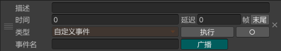  
* 当选中「广播」复选按钮时，事件将会发送给指定GameObject上挂的所有自定义事件监听器。  
  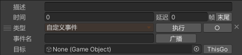  

### 实例化

该步骤类型用于实例化预制体或场景中的GameObject。  
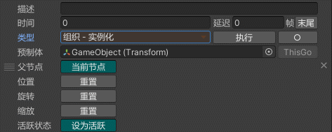  

* 父节点：可以选择当前节点为父节点或者另外指定父节点。  
* 位置、旋转、缩放：选中后，若指定节点，会将坐标旋转或缩放设置为与目标相同，否则，会将局部坐标、局部旋转或局部缩放重置为默认值。  
* 活跃状态：若选中，实例化后如果对象为非活跃状态，则会改为活跃状态，否则，不做改变。  

### 销毁

该步骤类型用于销毁场景中的GameObject。  
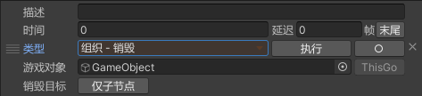  

* 仅子节点：若选中，则只销毁目标的所有子节点，否则，销毁目标。  

### 换父节点

该步骤类型用于将目标节点挂到另一个节点下面。  
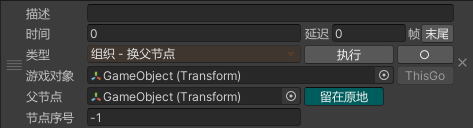  

* 留在原地：若选中，则会保持目标节点的的世界坐标，否则，保持目标节点的局部坐标。  
* 节点序号：目标节点在新的父节点下的序号，正数表示索引值，负数表示从后往前数，-1表示最后一位。  

### 活跃状态

该步骤类型用于修改目标GameObject的活跃状态。  
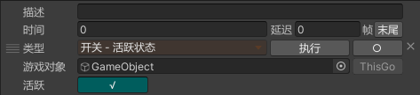  

### 启用状态

该步骤类型用于修改目标组件的启用状态，支持Behaviour、Renderer、Collider、LODGroup和Cloth。  
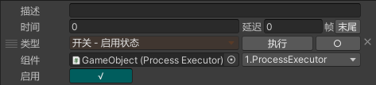  

### 变换

该步骤类型用于修改目标节点的位置、旋转和缩放。  
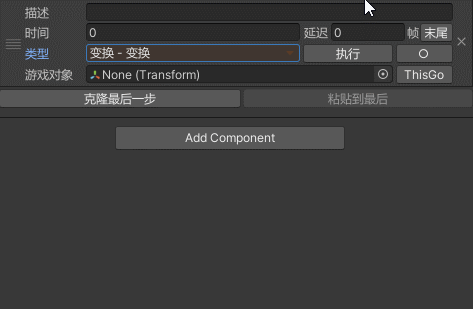  

* 类别：可选择局部坐标、局部欧拉角、缩放、世界坐标、世界欧拉角。  
* 坐标轴：可选择修改的向量分量，未选择的分量将保持原样。  
* 目标类型：可选择向量还是节点，如果是节点，则从节点中取出对应向量。  
* 随机：若选中，则目标将变成一个范围，并且如果坐标轴选择了一个以上的分量，则会出现「分开随机」复选按钮。  
  * 分开随机：分量之间单独随机。  
* 相对：若选中，则目标值将叠加到当前值上。  
* 缓动：启用补间动画，并出现动画参数项。  

### 朝向

该步骤类型用于修改节点的朝向。  
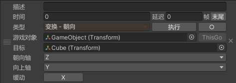  

* 朝向轴：选择以节点的那个局部轴朝向目标。  
* 向上轴：选择以节点的那个局部轴在上方。  

### 相对摄像机

该步骤类型用于将物体放置到摄像机指定视口坐标上。  
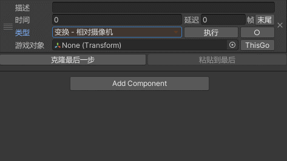  

* 坐标轴：可选择修改的向量分量，未选择的分量将保持原样。  
* 缓动：启用补间动画，并出现动画参数项。  

### 音频单次播放

该步骤类型用于播放一次音频。  
  

### 音频播放控制

该步骤类型用于控制AudioSource的播放、停止、暂停和继续。  
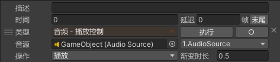  

* 操作：可选择「播放」、「停止」、「暂停」、「继续」和「暂停或继续」，其中「暂停或继续」在暂停的时候表现为继续功能，在播放中的时候表现为暂停功能。  
* 渐变时长：淡入淡出的时长。

### 音频播放多个

该步骤类型用于播放多个音频。  
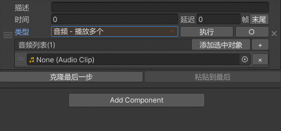  

* 当音频数量小于等于1时，就是单纯的播放一个音频。  
* 当音频数量大于1时，会出现其他参数。  
  * 播放个数：每次执行该步骤时，会播放几个音频。  
  * 其他参数：可选择依次播放和随机播放，该步骤每次执行完后，会记录上一次播放情况，以判断下一次如何播放。  
    * 依次播放：从上往下挨个播放，当播放到列表末尾时，会从头继续播放，该播放方式下会有洗牌选项。  
      * 不洗牌：正常的列表循环。  
      * 初始时洗一次：初始化时打乱列表顺序，之后无论循环几次，顺序都不再变化。  
      * 循环时洗牌：每次播放列表第一个前都会洗牌。  
    * 随机播放：从列表中随机选中指定个数播放，播放个数始终小于列表长度，该播放方式下会有随机选项。  
      * 无限制：正常随机  
      * 不重复：上一次播放过的音频，不会加入到随机范围内。如果上一次播放个数与将播放个数之和大于列表长度，则该选项无效。  

### 动画参数控制

该步骤类型用于控制Animator组件内的自定义参数。  
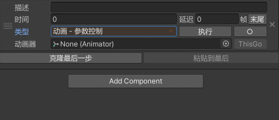  

* 参数：自动识别Animator组件内有哪些自定义参数，以下拉框的形式供选择。不同类型的参数，会显示不同界面。  
  * Float：显示浮点数输入框、「相对偏移」复选按钮、缓动选项。  
  * Int：显示整数输入框、「相对偏移」复选按钮、缓动选项，缓动选项内还有个取整方式选项，可选向下取整、向上取整或四舍六入五成双。  
  * Bool：显示「√」或「×」按钮  
  * Trigger：显示「触发」或「取消」复选按钮  

### 动画换状态机

该步骤类型用于替换Animator组件内AnimatorController。  
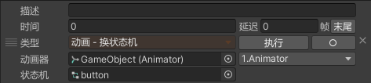  

### 动画换形象

该步骤类型用于替换Animator组件内Avatar。  
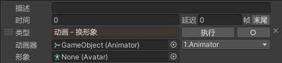  

### 动画根移动

该步骤类型用于控制Animator组件的「Apply Root Motion」勾选情况。  
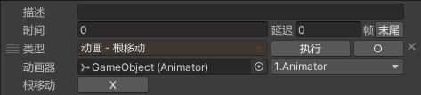  

### 时间轴播放控制

该步骤类型用于控制PlayableDirector组件的播放。  
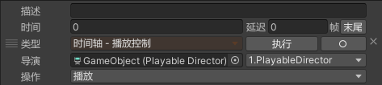  

* 操作：可选择「播放」、「停止」、「暂停」、「继续」和「暂停或继续」，其中「暂停或继续」在暂停的时候表现为继续功能，在播放中的时候表现为暂停功能。  

### 时间轴跳转进度

该步骤类型用于控制PlayableDirector组件的进度跳转。  
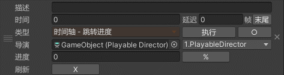  

* 进度：未选中「%」复选按钮时，进度为输入框，可输入秒数；选中「%」复选按钮时，进度为0到1的滑动条。  
* 刷新：跳转进度后，是否调用PlayableDirector.Evaluate函数。

### 缓动从头开始

该步骤类型用于控制DOTweenAnimation或DOTweenPath组件从头播放。  
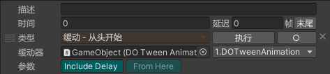

* Include Delay：当DOTween组件有设置延迟时，选中可使延迟每次执行都生效。
* From Here：若控制对象为DOTweenAnimation，当缓动类型为移动且勾选了「Relative」时，或控制对象为DOTweenPath，当勾选了「Scale/Rotate W Target」而没有勾选「Local Movement」时，「From Here」可选中，选中后，每次执行的缓动，都是在当前基础上继续运动。

### 缓动播放控制

该步骤类型用于控制DOTweenAnimation或DOTweenPath组件的播放。  
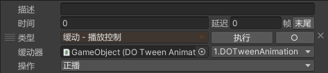

* 操作：可选择「正播」、「倒播」、「暂停」、「继续」和「暂停或继续」，其中「暂停或继续」在暂停的时候表现为继续功能，在播放中的时候表现为暂停功能。  

### 缓动跳转进度

该步骤类型用于控制DOTweenAnimation或DOTweenPath组件的进度跳转。  
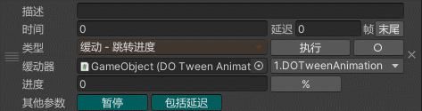

* 进度：未选中「%」复选按钮时，进度为输入框，可输入秒数；选中「%」复选按钮时，进度为0到1的滑动条。当进度为0时，会出现「包括延迟」复选按钮。
* 暂停：如果原本正在播放，跳转进度后，是否暂停播放。
* 包括延迟：跳转到进度0后继续播放，延迟是否生效。

### 缓动杀死或重生

该步骤类型用于控制DOTweenAnimation或DOTweenPath组件的释放和重置。  
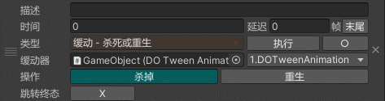

* 操作：可选择「杀掉」和「重生」，对应Kill函数和CreateTween函数。当选择「杀掉」时，会出现「跳转终态」复选按钮。  

### Unity事件

该步骤类型用于执行一个无参的Unity事件。  
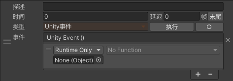  